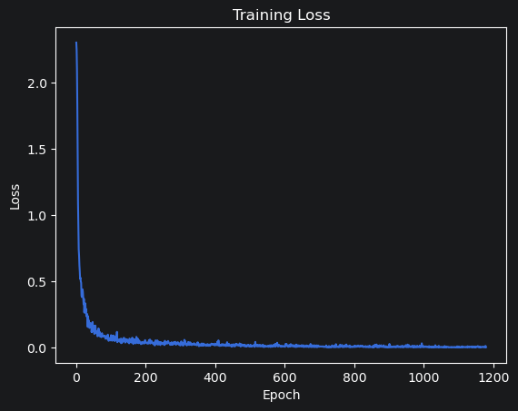

# MNIST CNN PyTorch

A classic handwritten digit classification project based on PyTorch and CNN.

## Project Structure

mnist-cnn-pytorch/
│
├── models/
│   └── cnn.py
├── train.py
├── test.py
├── predict.py
├── README.md
├── requirements.txt
└── results/

---

## Model Architecture

Input (1×28×28)
↓
Conv2d(1 → 16)
↓
ReLU
↓
Conv2d(16 → 32)
↓
ReLU
↓
Conv2d(32 → 64)
↓
ReLu
↓
MaxPool2d
↓
Linear
↓
Output (10 classes)

--
## Training Result
accuracy: 0.9907
## Loss Curve
